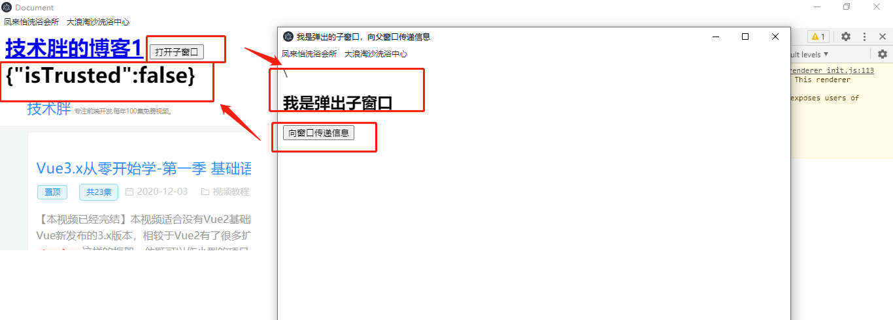

### 初始化

> 配置

```
//淘宝镜像
npm install -g cnpm --registry=https://registry.npm.taobao.org
cnpm install -g electron
//容易报错
npm install electron --save-dev

新建Index.html,主进程加载那个页面index.html

新建main.js, electron 主进程文件

创建package.json npm init --yes
npm install
这时候main的值为main.js就正确了。这时候就可以打开终端

在终端里输入electron .就可以打开窗口了。

```

> 验证electron

```

//查看版本
npx electron -v

//启动命令
./node_modules/.bin/electron
```

> electron运行机制

1. 读取package.json的中的入口文件,这里我们是main.js
2. main.js 主进程中创建渲染进程
3. 读取应用页面的布局和样式
4. 使用IPC在主进程执行任务并获取信息
5. 主进程只有一个，渲染进程可以有多个

>主进程和渲染进程

1. 我们可以理解package.json中定义的入口文件就是主进程,那一般一个程序只有一个主进程,而我们可以利用一个主进程,打开多个子窗口.

2. 由于 Electron 使用了 Chromium 来展示 web 页面，所以 Chromium 的多进程架构也被使用到。 每个 Electron 中的 web 页面运行在它自己的渲染进程中,也就是我们说的渲染进程.也就是说主进程控制渲染进程,一个主进程可以控制多个渲染进程.

> 主线程的菜单栏

需要注意的是，Menu属于是主线程下的模块，所以只能在主线程中使用，这个要记清楚。

> 创建右键菜单，需要监听contextmenu

> 使用shell在浏览器打开,而不是electron内置浏览器打开

```shell.openExternal()```

> electron中嵌入网页和打卡子窗口

1. BrowserView来嵌入一个网页到我们应用中，这很类似Web中的<iframe>标签。需要注意的是BrowserView是主进程中的类，所以只能在主进程中使用。

2. 用window.open打开子窗口

> window.opener.postMessage(message,targetOrigin),是将消息发送给指定来源的父窗口，如果未指定来源则发送给*，即所有窗口。

1. message : 传递的消息，是String类型的值,targetOrigin : 指定发送的窗口

2. 在传递消息时，你需要在子窗口的页面中设置一些内容，所以我们不能使用远程的页面，而需要自己建立一个。在项目根目录，建立一个popup_page.html文件。 代码如下(详细解释在视频中讲解)

3. 父窗口接收信息需要通过window.addEventListener
<!--  -->

> 选择文件对话框

- 打开文件选择对话框可以使用dialog.showOpenDialog()方法来打开，它有两个参数，一个是设置基本属性，另一个是回调函数，如果是异步可以使用then来实现。

    title ： String (可选)，对话框的标题
    defaultPath ： String (可选),默认打开的路径
    buttonLabel ： String (可选), 确认按钮的自定义标签，当为空时，将使用默认标签
    filters ： 文件选择过滤器，定义后可以对文件扩展名进行筛选
    properties：打开文件的属性，比如打开文件还是打开文件夹，甚至是隐藏文件。

 -   保存对话框 

> 弹出对话框,  dialog.showMessageBox

- 为什么会鼓励使用showMessageBox，因为这样比JS里的alert更加灵活,比如可以设置按钮，可以设置title。

> 断网检测

- 其实这个是JavaScript的一种方式进行监听网络状态,监听的事件分别是online和offline。

    online : 如果链接上网络，就会触发该事件。
    offline : 如果突然断网了，就会触发该事件。

> 点击按钮window弹出提示消息

  ```
  var notifyBtn = document.getElementById('notifyBtn');

      var option = {
          title:'小二,来订单了，出来接客了!',
          body:'有大官人刚翻了你的牌子',

      }
      notifyBtn.onclick = function(){
        new  window.Notification(option.title,option)
      }

  ```
>  注册快捷键

- globalShortcut是主进程中的模块，而且注册的都是全局的快捷键，所以你尽量写在main.js中。打开main.js，然后先引入globalShortcut，代码如下：

    ```
    var  globalShortcut = electron.globalShortcut

    ```

-  引入后，我们现在的需求是按快捷键ctrl+e键后，打开我的博客https://jspang.com。这时候使用globalShortcut.register方法就可以实现，全部代码如下:

```
var electron = require('electron') 

var app = electron.app   
var  globalShortcut = electron.globalShortcut

var BrowserWindow = electron.BrowserWindow;  

var mainWindow = null ;  
app.on('ready',()=>{
    mainWindow = new BrowserWindow({width:800,height:600})  

    globalShortcut.register('ctrl+e',()=>{

        mainWindow.loadURL('https://jspang.com')  
    })

    let isRegister= globalShortcut.isRegistered('ctrl+e')?'Register Success':'Register fail'

    console.log('------->'+isRegister)


    mainWindow.loadFile('test.html')  

    //监听关闭事件，把主窗口设置为null
    mainWindow.on('closed',()=>{
        mainWindow = null
    })

})

app.on('will-quit',function(){
    //注销全局快捷键的监听
    globalShortcut.unregister('ctrl+e')
    globalShortcut.unregisterAll()

})
```

- 注意关闭后注销ctrl+e